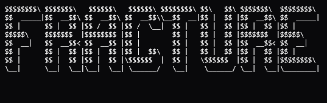

<p align="center">
  
</p>

Fast desktop scene-splitting software for editors.

Fracture helps editors turn long videos into usable clips quickly. Import a video, split it into scenes, preview each clip individually, curate your timeline, and export only what you want — all lossless, all local.

## Features

- **Physical scene splitting** — ffmpeg segment muxer splits video into individual `.mp4` scene files (stream copy, no re-encode)
- **DBSCAN clustering** — groups visually similar scenes by RGB colour analysis (eps=45, minPts=2)
- **Black/white frame removal** — auto-detected and marked as Noise cluster
- **Per-clip preview** — click any scene tile to load its individual clip in the preview panel
- **Hover preview** — hover a scene thumbnail to seek the preview video to that timestamp
- **Collapsible preview panel** — toggleable, shows time badge, dismissable
- **Lossless MP4 export** — stream-copy (`-c copy`) concatenation, no quality loss
- **Multi-theme support** — Moonlight, Amethyst, Frost, Ember with instant switching
- **Customizable font picker** — JetBrains Mono, Fira Code, Inter, SF Mono
- **Export history** — browse and re-access past exports
- **Settings panel** — clustering, hardware, and export preferences
- **Frameless Wails-native window** — custom window controls (minimize, maximize, close)
- **Import progress bar** — 0→100% with real-time stage tracking via Wails events

## How It Works

```
Frontend (React + TypeScript + Tailwind)
          ↓
Desktop Layer (Wails v2 + Go — frameless, HTTP media server)
          ↓
FFprobe (keyframes) → GetFrameColor (RGB) → DBSCAN (clustering)
          ↓
FFmpeg segment muxer (physical split into scene .mp4 files)
          ↓
FFmpeg (parallel thumbnail generation)
```

### Frontend

Handles:

- importing videos
- per-clip preview panel (toggleable)
- scene grid with cluster filter buttons
- timeline curation (drag-select + export)
- settings, themes, font picker
- export history

### Go Backend

Handles:

- keyframe extraction via ffprobe packet scan (sub-second)
- per-frame colour extraction (1×1 ffmpeg pixel → RGB feature vectors)
- DBSCAN clustering on RGB features
- black/white frame detection (threshold-based)
- physical video splitting via ffmpeg segment muxer (`-f segment`)
- HTTP Range video / clip / thumbnail streaming
- lossless stream-copy MP4 export
- file system operations

### Why Keyframes + Segment Split?

Older scene detection used frame-by-frame analysis or full-decode brightness probes.

The current version uses ffprobe keyframe packet scan + ffmpeg segment split:

- **much faster** — seconds instead of minutes
- **individual scene files** — each scene is its own playable `.mp4`
- **lossless splitting** — `-c:v copy` preserves original quality
- **colour-based clustering** — DBSCAN on RGB values groups visually similar scenes
- **noise filtering** — black/white frames flagged for easy removal

## Repository Structure

```
fracture-ui/
│
├── app.go                  # Go backend (keyframes, colour analysis, DBSCAN, segment split, streaming, export)
├── main.go                 # Application entry point (frameless window config)
├── wails.json              # Wails configuration
├── go.mod / go.sum         # Go module
│
├── frontend/
│   ├── src/
│   │   ├── App.tsx         # Main React component (all pages + preview panel)
│   │   ├── main.tsx        # Vite entry point
│   │   ├── index.css       # Tailwind + theme CSS variables
│   │   └── components/
│   │       ├── TitleBar.tsx # (unused — frameless mode uses floating controls)
│   │       └── Sidebar.tsx  # Side navigation
│   ├── package.json
│   └── ...
│
├── build/
│   ├── appicon.png         # App icon
│   └── windows/
│       └── icon.ico        # Windows icon
│
└── README.md
```

## Getting Started

### Requirements

Install:

- **Go** 1.21+
- **Node.js** 18+ + pnpm
- **Wails** v2 CLI (`go install github.com/wailsapp/wails/v2/cmd/wails@latest`)
- **FFmpeg** / **FFprobe** (on PATH)
- **Windows** (current main target)

### Dev Mode

```bash
git clone https://github.com/yovyshh/Fracture.git
cd fracture-ui
wails dev
```

Opens a native frameless window with hot-reload on both Go and frontend changes.

### Build Desktop App

```bash
wails build
```

Produces a standalone `.exe` in `build/bin/`.

## Current Focus

- CLIP embeddings for semantic scene clustering (replace RGB proxy)
- HDBSCAN for truly automatic cluster count
- More export formats (MKV, WebM, GIF)
- Preserve original codec/settings by default
- Quality slider for export bitrate
- Hover audio playback (toggleable)
- Clip timestamps shown under grid clips
- Original aspect ratio clip cells
- Linux / macOS support

## License

Fracture is licensed under the MIT License

Any derivative work must also be open-source under the same license.
